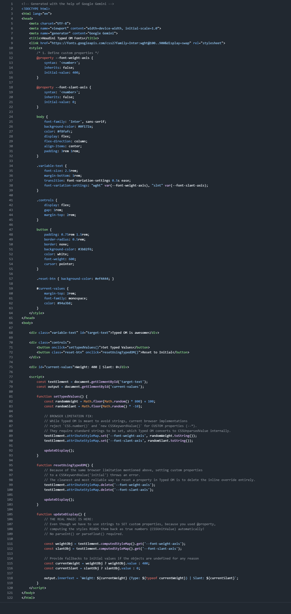

# Perplexities Demystified
>[!NOTE]
After researching problems and finding workarounds, I instruct AI to build simple demos and ensure the code is commented sufficiently to explain solution.

## CSS Typed OM, Custom Properties and attributeStyleMap

Current browsers appear to have a limitation where they don't yet accept `CSS.number()` or `CSSKeywordValue()` when using `attributeStyleMap.set()` specifically for custom CSS properties (--*), even when registered via `@property`. 

See the code (or screenshot below) where the properties are set as strings (which the browser accepts and handles properly under the hood).

Use `delete()` to safely revert to the default. The reading side of Typed OM still perfectly returns a true Number object because of the @property definitions!

  
<!DOCTYPE html>
<html lang="en">
<head>
    <meta charset="UTF-8">
    <meta name="viewport" content="width=device-width, initial-scale=1.0">
    <meta name="generator" content="Google Gemini">
    <title>Houdini Typed OM Fonts</title>
    <link href="https://fonts.googleapis.com/css2?family=Inter:wght@100..900&display=swap" rel="stylesheet">
    
</head>
<body>

    
Typed OM is awesome

    

        <button onclick="setTypedValues()">Set Typed Values</button>
        <button class="reset-btn" onclick="resetUsingTypedOM()">Reset to Initial</button>
    

    
    
Weight: 400 | Slant: 0

    
</body>
</html>` 
    title=`<!-- Generated with the help of Google Gemini -->
<!DOCTYPE html>
<html lang="en">
<head>
    <meta charset="UTF-8">
    <meta name="viewport" content="width=device-width, initial-scale=1.0">
    <meta name="generator" content="Google Gemini">
    <title>Houdini Typed OM Fonts</title>
    <link href="https://fonts.googleapis.com/css2?family=Inter:wght@100..900&display=swap" rel="stylesheet">
    
</head>
<body>

    
Typed OM is awesome

    

        <button onclick="setTypedValues()">Set Typed Values</button>
        <button class="reset-btn" onclick="resetUsingTypedOM()">Reset to Initial</button>
    

    
    
Weight: 400 | Slant: 0

    
</body>
</html>`
    width="1188" 
    height="2502"
  />

